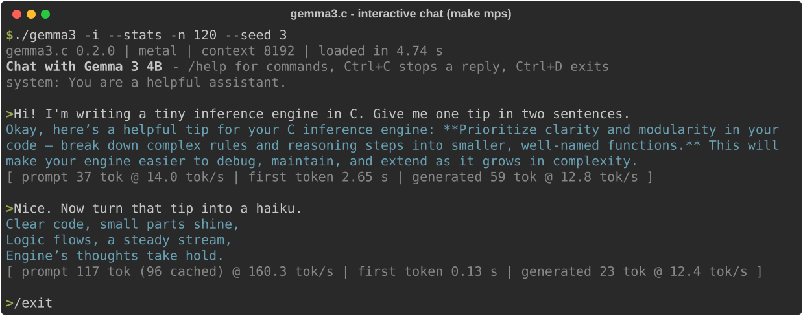
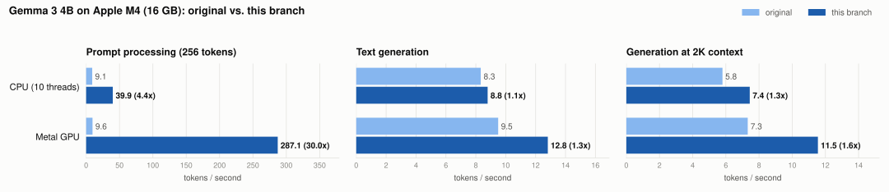
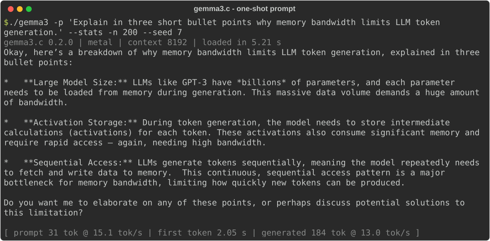

# gemma3.c

[](https://github.com/robitec97/gemma3.c/actions/workflows/ci.yml)

A **from-scratch inference engine for Google's Gemma 3 4B IT**, written in pure C11.
No Python, no ML framework, no dependencies. It runs on the CPU (NEON / AVX2,
multi-threaded) or on Apple Silicon GPUs through a hand-written Metal backend.

<p align="center">
  <picture>
    
  </picture>
</p>

## Highlights

* **Pure C11, zero dependencies.** Metal and Accelerate are optional, macOS only.
* **Faithful Gemma 3:**
  * grouped-query attention with 5:1 local/global sliding-window layers
  * QK-norm and linear RoPE scaling
  * logits match an independent reference implementation to **1e-4**
* **Exact tokenizer:** SentencePiece BPE with special tokens, verified token-for-token
  against Hugging Face `tokenizers`. It runs at 3-11 MB/s.
* **Fast:**
  * BF16 SIMD kernels (NEON, AVX2+FMA) and batched prompt processing
  * a low-latency thread pool
  * a Metal GPU backend with zero-copy weights
* **Memory-mapped BF16 weights.** The model loads in well under a second, with no conversion step.
* **Multi-turn chat that reuses the KV cache.** Each turn only processes the new tokens.
* **CLI and library API:** streaming callbacks and timing statistics (TTFT, prefill and decode tokens/s).
* **Tested:**
  * unit tests and tokenizer golden tests
  * end-to-end checks and a reference-logit comparison
  * CI on Linux x86-64/arm64 and macOS, with ASan/UBSan

## Performance

<p align="center">
  <picture>
    <source media="(prefers-color-scheme: dark)" srcset="docs/images/speedup-dark.svg">
    
  </picture>
</p>

Gemma 3 4B IT, BF16 weights, MacBook Air **M4** (4P+6E CPU cores, 10-core GPU, 16 GB):

| Build | Prompt processing (pp256) | Generation (tg128) | Time to first token (256-token prompt) | Load |
|-------|--------------------------:|-------------------:|-------------------------:|-----:|
| `make` (CPU, NEON, 10 threads) | TBD | TBD | TBD | TBD |
| `make mps` (Metal GPU) | TBD | TBD | TBD | TBD |
| *original, `make threads`* | *12.2 tok/s* | *11.3 tok/s* | *21 s* | *0.1 s* |
| *original, `make mps`* | *15.2 tok/s* | *12.9 tok/s* | *17 s* | *2.9 s* |
| *original, `make` (default)* | *0.6 tok/s* | *0.5 tok/s* | *7 min* | *0.1 s* |

Other measured improvements:

| | Original | Now |
|---|---:|---:|
| Tokenizer throughput | 389 bytes/s (4 KB prompt: 10.4 s) | 3.4 MB/s (4 KB prompt: 1.2 ms) |
| Sampling cost per token (top-k 50, top-p 0.9) | 9.2 ms | 0.08 ms |
| Second chat turn | re-processes the whole conversation | only the new tokens (KV cache reuse) |
| Extra RAM for Metal weights | ~8 GB copy | 0 (zero-copy) |

Generation is memory-bandwidth bound. Every token streams all 7.8 GB of
weights, so the M4's ~120 GB/s caps decoding at roughly 15 tok/s. Prompt
processing is compute bound and gains the most from batching.

**Reproduce:** `make bench && ./gemma3-bench -p 64,256,1024 -n 128`. For every
backend, run `scripts/bench.sh`. See [Benchmarks](#testing-and-benchmarks).

## Quick start

### 1. Download the model

The official weights are gated. Accept the license at
[huggingface.co/google/gemma-3-4b-it](https://huggingface.co/google/gemma-3-4b-it),
create a [token](https://huggingface.co/settings/tokens), then:

```bash
pip install huggingface_hub
HF_TOKEN=hf_... python download_model.py      # ~8.6 GB into ./gemma-3-4b-it
```

### 2. Build

```bash
make            # CPU: native SIMD (NEON / AVX2) + all cores   - Linux, macOS, WSL
make mps        # Apple Silicon GPU (Metal), with CPU fallback  - recommended on Macs
```

### 3. Run

```bash
./gemma3 -p "Explain quantum computing simply."     # one-shot prompt
./gemma3 -i                                          # interactive chat
cat notes.md | ./gemma3 -s "Summarize the user's text in 3 bullets."
./gemma3 -p "Write a haiku about pointers" --stats  # with timing statistics
```

<p align="center">
  
</p>

## Build targets

| Target | Description |
|--------|-------------|
| `make` | Optimized CPU build: `-O3`, native SIMD (NEON / AVX2+FMA) and a thread pool. **Default.** |
| `make mps` | Metal GPU backend for Apple Silicon (falls back to the CPU if Metal is unavailable) |
| `make blas` | CPU build that uses BLAS `sgemm` for prompt processing (Accelerate on macOS, OpenBLAS elsewhere) |
| `make portable` | CPU build without `-march/-mcpu=native`, for binaries you ship to other machines |
| `make debug` / `make asan` | Debug build / AddressSanitizer + UBSan build |
| `make test` | Kernel, sampler and thread-pool unit tests (no model needed) |
| `make test-model` | Tokenizer golden tests, KV-cache tests and end-to-end checks (needs the model) |
| `make bench` / `make bench-kernels` | End-to-end benchmark / kernel micro-benchmarks |
| `make example` | Build the library example in `examples/simple.c` |

The old target names (`threads`, `fast`, `blas-threads`, `mps-threads`) still
work. Threads are now always enabled. Set `EXTRA_CFLAGS=-DGEMMA3_NO_SIMD` to
build the plain C kernels only.

## Command line

```
Input:
  -p, --prompt <text>     Prompt text (use '-' to read from stdin)
  -f, --file <path>       Read the prompt from a file
  -i, --interactive       Interactive multi-turn chat
  -s, --system <text>     System prompt (default: "You are a helpful assistant.")
                          Without -p/-f/-i, a piped stdin is used as the prompt.

Model and runtime:
  -m, --model <path>      Model directory (default: $GEMMA3_MODEL or ./gemma-3-4b-it)
  -c, --context <n>       Context size in tokens (default: 8192)
      --threads <n>       CPU threads (default: $GEMMA3_THREADS or all cores)
      --cpu               Use the CPU even in a Metal (make mps) build

Generation:
  -n, --max-tokens <n>    Max tokens to generate (default: 512)
  -t, --temperature <f>   Sampling temperature (default: 0.7, 0 = greedy)
  -k, --top-k <n>         Top-k sampling (default: 50, 0 = disabled)
      --top-p <f>         Top-p (nucleus) sampling (default: 0.9)
      --min-p <f>         Min-p sampling (default: 0 = disabled)
      --seed <n>          Random seed (default: -1 = random)
      --greedy            Deterministic greedy decoding

Output:
      --stats             Print timing stats (TTFT, prefill and decode tokens/s)
  -q, --quiet             Don't print the model loading line
  -v, --verbose           Verbose loading output and model configuration
      --no-color          Disable colored output (also honours NO_COLOR)

Debugging:
      --tokenize          Print the token IDs of the prompt
      --detokenize        Decode comma-separated token IDs given as the prompt
      --logits            Show the top-20 next-token logits for the prompt
      --verbose-tokens    Print each sampled token ID to stderr
```

### Interactive chat

`./gemma3 -i` keeps the whole conversation in context. The KV cache is reused
between turns, so replying stays fast as the conversation grows. When the
conversation no longer fits, the oldest exchanges are dropped.

| Command | Action |
|---------|--------|
| `/clear` | Start a new conversation |
| `/system <text>` | Set a new system prompt (starts over) |
| `/stats` | Toggle per-reply timing statistics |
| `/help` | List commands |
| `/exit`, `/quit`, Ctrl+D | Leave |
| Ctrl+C | Stop the current reply (also while the prompt is being processed) |
| `\` at end of line | Continue typing on the next line |

## Library API

```c
#include "gemma3.h"

gemma3_load_options opts = gemma3_default_load_options();
opts.max_context = 4096;                       /* also: num_threads, use_gpu, verbose */
gemma3_ctx *ctx = gemma3_load_dir_opts("./gemma-3-4b-it", &opts);

gemma3_message chat[] = {
    { GEMMA3_ROLE_SYSTEM, "You are a concise assistant." },
    { GEMMA3_ROLE_USER,   "Name three famous C programmers." },
};
gemma3_gen_params params = gemma3_default_params();
char *reply = gemma3_chat(ctx, chat, 2, &params, on_token, user_data);  /* streams */

const gemma3_stats *s = gemma3_get_stats(ctx);
printf("TTFT %.0f ms, %.1f tok/s\n", s->ttft_ms, s->decode_tok_per_s);

free(reply);
gemma3_free(ctx);
```

* `gemma3_chat()` / `gemma3_generate()` automatically reuse the longest prompt
  prefix that is already in the KV cache.
* `gemma3_token_to_bytes()` decodes one token for streaming.
* `gemma3_abort()` is async-signal-safe and stops a running generation.
* `gemma3_tokenize()`, `gemma3_forward()` and `gemma3_forward_batch()` give
  low-level access.

[`examples/simple.c`](examples/simple.c) is a complete two-turn example
(`make example`). See [`gemma3.h`](gemma3.h) for the full API.

## Testing and benchmarks

```bash
make test               # SIMD kernels vs double-precision references, sampler, thread pool
make test-model         # tokenizer golden tests (vs HF tokenizers), KV-cache reuse, end-to-end
make bench-kernels      # matvec GB/s, GEMM GFLOP/s, dispatch latency, sampler cost (no model)
make bench && ./gemma3-bench -p 64,256,1024 -n 128 --json out.json
scripts/bench.sh        # build every backend and benchmark it -> bench/results/*.json
```

**Numerical validation.** [`tools/reference_forward.py`](tools/reference_forward.py)
is an independent NumPy implementation of the Hugging Face Gemma 3 forward pass.
[`tools/compare_logits.py`](tools/compare_logits.py) checks any build against it:

```
prompt                                        top20  max|diff|  argmax
The capital of France is (6 tok)              20/20     0.0001     yes
def fibonacci(n):\n    if n < 2... (22 tok)   20/20     0.0001     yes
Water boils at a temperature of (7 tok)       20/20     0.0001     yes
Section 1. The history of compu... (1490 tok) 20/20     0.0001     yes
```

The 1490-token prompt covers the sliding-window ring buffers and the scaled
global RoPE. Kernel micro-benchmarks on the M4:

| Kernel | 1 thread | 10 threads |
|--------|---------:|-----------:|
| BF16 matvec, 10240x2560 (decode) | 26 GB/s | 82 GB/s |
| BF16 matvec, 262144x2560 (lm head) | 23 GB/s | 96 GB/s |
| BF16 GEMM, 10240x2560, 128 tokens (prefill) | 88 GFLOP/s | 463 GFLOP/s |
| Thread-pool round trip | | 1.9 µs |
| Sampler (vocab 262k) | 0.08 ms/token | |

## How it works

| File | Contents |
|------|----------|
| `gemma3.h` | Public API |
| `gemma3.c` | Loading, generation loop, KV-cache prefix reuse, sampling, statistics |
| `gemma3_transformer.c` | CPU forward pass: chunked prefill/decode, attention, KV ring buffers |
| `gemma3_kernels.c` | NEON / AVX2 / scalar kernels: BF16 matvec and GEMM, norms, GELU, RoPE, attention, sampler |
| `gemma3_threads.c` | Spin-then-sleep thread pool with dynamic scheduling |
| `gemma3_metal.m` | Metal backend: embedded MSL kernels, zero-copy weights, batched GPU prefill |
| `gemma3_tokenizer.c` | SentencePiece BPE (heap-based), special tokens, chat template |
| `gemma3_safetensors.c` | mmap'd SafeTensors loader with header and shape validation |

* **Prefill and decode share one path.** Tokens go through the network in
  chunks of up to 128. Every projection is a BF16 GEMM, so each weight is
  read once per chunk instead of once per token. Decoding is a chunk of one.
* **Weights stay in BF16** in the memory-mapped file. They are widened to F32
  in registers (a 16-bit shift), and accumulation is F32.
* **KV cache.** Global layers keep every position. Local layers keep a ring of
  1024 + 128 positions: the extra 128 slots let a whole chunk be written
  before attention runs, and they let the cache be rewound when a new prompt
  diverges from the cached one.
* **Threads.** The calling thread takes part in every parallel job. Workers
  spin for ~2 ms before sleeping, which keeps dispatch at a few microseconds
  for the hundreds of jobs per token. Work is handed out in chunks, so Apple's
  performance cores pick up more of it than the efficiency cores.

### Model specs

| Param | Value |
|-------|-------|
| Vocab | 262,208 |
| Layers | 34 (5 local : 1 global) |
| Hidden / intermediate | 2,560 / 10,240 |
| Heads | 8 query, 4 KV (GQA), head dim 256 |
| Sliding window | 1,024 |
| RoPE | theta 10K local, 1M global with linear scaling x8 |
| Context | up to 128K (default allocation 8K) |

### Memory

* Weights: 8.6 GB on disk, memory-mapped. The OS pages them in and can share
  them between processes.
* KV cache: about 0.5 GB at the default 8K context. Global layers grow with
  `-c`; local layers are fixed.
* Activations and scratch: about 20 MB.

On a 16 GB machine, close memory-hungry apps for the best generation speed.

## Limitations

* Text only (the vision tower is not implemented)
* BF16 weights only (no quantization yet)
* Gemma 3 4B shapes are compile-time constants

## Review notes

[`docs/REVIEW.md`](docs/REVIEW.md) lists the issues found in a full code review
(tokenizer, chat template, RoPE scaling, sampling, robustness, performance) and
how each was fixed.

## License

MIT License. Model weights are under Google's [Gemma license](https://ai.google.dev/gemma/terms).
